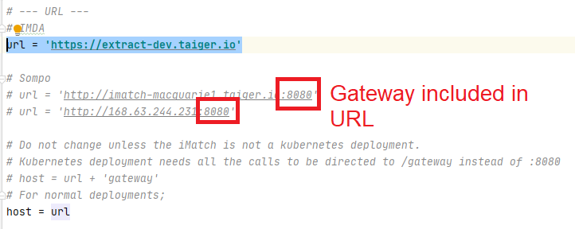
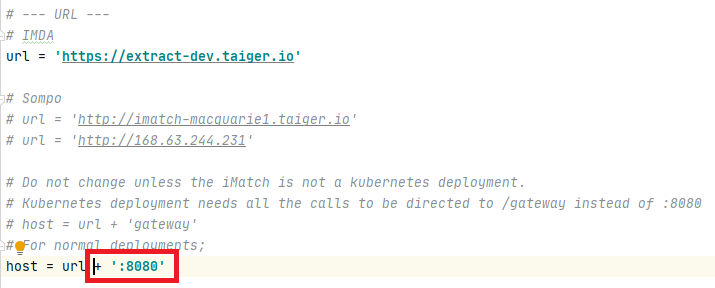
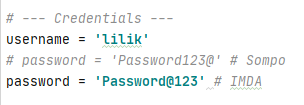
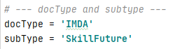
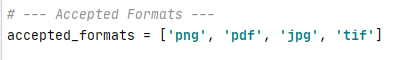
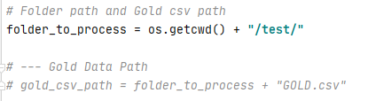

# QA - Automation tool for Extract(iMatch).
Not to be confused with QA tool in Extract(iMatch) slated for future releases.

## What does it do ?
+ Calls Extract's (iMatch's) APIs to upload files in bulk (without crashing pipeline)
+ Get HTML for GATE's GUI
+ Get processed data in excel

## What can you use it for ?
+ Bulk upload the documents for the give type and sub-type. 
+ Get the HTML outputs of OCR for the uploaded documents (Can be used for GATE Development)
+ Get extracted data then generate an excel sheet that can be used for accuracy report

## Why is it needed if future iMatch will have inbuilt QA.
+ *For current and legacy releases*: We have developed and deployed older versions of iMatch for few clients. 
+ *Bulk Upload* : The current pipeline doesn't wait for the document to be completely processed in OCR stage; before sending another file. This tool waits for the current document to complete OCR stage before sending next one. 

## What files can this process ?
+ 'png', 'pdf', 'jpg', 'tif' and other formats supported by iMatch. You can add other formats in ```accepted_formats``` in config.py

## Limitation(s) of this script
+ Current version will fail with HTTPS authentication. 
+ Can upload one document type at once. 
+ The current tool also will not processed the document if its name is already recorded at iMatch


## Technical Documentation
### Pre Requirements 
    + [Python](https://www.python.org)
    + [Pycharm](https://www.jetbrains.com/pycharm/) or any other IDE.

### Libraries needed
+ pandas
+ requests
+ xlsxwriter
+ certifi
+ chardet
+ Click
+ Flask
+ idna
+ itsdangerous
+ Jinja2
+ Markupsafe
+ numpy
+ python-dateutil
+ pytz
+ six
+ urrlib3
+ Werkzeug

### How to use the script
+ Clone this repository in your local machine using command `git clone https://github.com/taigers/QA-Automation`
+ Add all your documents to `QA-Automation/test` folder. 
+ Create virtual environment for this script.
+ Copy/cut QA Automation repository to previously created virtual environment.
+ Install all dependencies required within requirements.txt within the virtual environment
+ Made necessary changes to config.py
+ Run the `processfolder.py`

### Details on config.py
#### URL
The ```url``` variable can be filled with the endpoint of targeted iMatch service that will be uploaded by documents given. The ```url``` variable also related to ```host``` variable because the ```host``` variable will be used in ```processFolder.py``` to get the ```token_id``` from given endpoint. If possible, include the gateway of the endpoint within the ```url``` variable.

Example:

Include gateway within the url variable


Gateway combined in the host variable


The list of endpoints that can be used for specific projects.

| Project | URL |
|:-------:|:----:|
|IMDA|https://extract-dev.taiger.io|
|Medical/Sompo|http://imatch-macquarie1.taiger.io:8080 <br> http://168.63.244.231:8080|

#### Credentials
For variables in credentials category, there are two variables that will be used. First one is username and second one is password. These credentials can be obtained by asking developers.

Example:



#### Document type and subtype
For a particular project, there are several document type and subtype that can be used to upload certain document related to the subtype. Here’s the example list of the docType and subType variables that can be used for a project.

|Project|docType|subType|
|:-------:|:-------:|:-------:|
|IMDA|IMDA|AttendanceSheet<br>SkillFuture<br>FinalCert<br>CertificateOfCompletion<br>DCA|
|Medical/Sompo|Medical|medicalCertificates<br>medicalInvoices<br>medicalCertificates_Sompo<br>medicalInvoices_Sompo|
|VFS|Identity|passport|

Example:



#### Accepted Formats
The ```accepted_formats``` variable is a list of formats that can be used and accepted by iMatch. The default accepted formats are 'png', 'pdf', 'jpg', and 'tif'. However if a project supports other formats e.g. 'xls', 'xlsx', 'doc', or 'docx', it can be added to this variable.

Example:



#### Folder Path
Any documents that will be uploaded must be put within ```test``` folder. Inside the script, there’s Gold Data Path but this path variable won’t be used anymore because the purpose of this data is to be compared with data extracted from iMatch. One improvement from the new script is the output result only show the extracted data and the gold data still filled manually by QA.



### Details on processFolder.py
#### Flowchart


#### Functions
Comments on how each function works have been put within the script.
